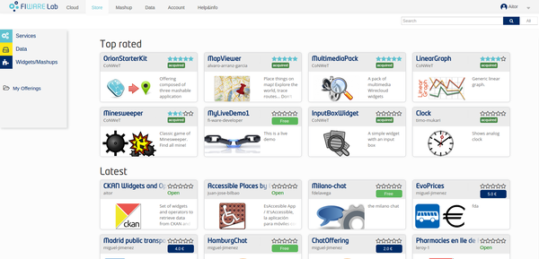
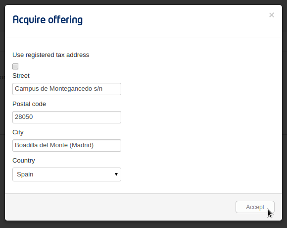
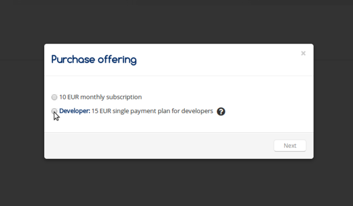
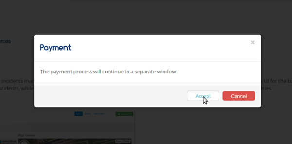
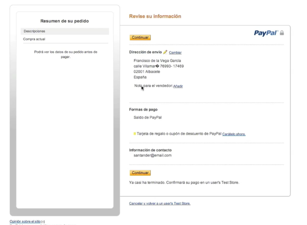
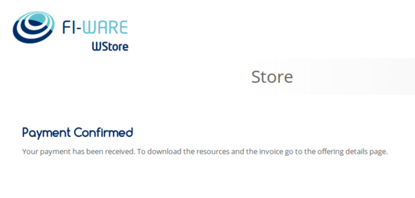
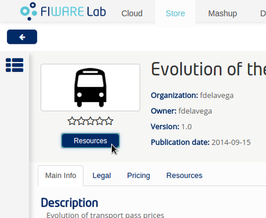
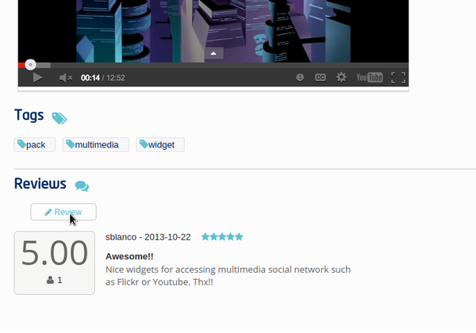
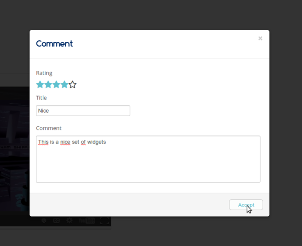

# WStore Customers Guide

.fx: cover

@conwet

---
## Search for offerings

.fx: section-title

---
## Search for offerings

* There are some options for searching offerings in WStore, As it can be seen in the following image, the main page contains the Top rated and the latest offerings

---
## Search for offerings

* To search using a keyword type it in the textbox and press *Search*

---
## Search for offerings

* The offerings that match the search are shown.

---
## Search for offerings

* It is also possible to view all the offerings selecting the *All*
button.

---
## Acquiring an offering

.fx: section-title

--
## Acquiring an offering

* The first step to acquire a published offering is selecting it after
searching. To start with the purchasing process click on the button
included in the offering.

---
## Acquiring an offering

* Arternatively, it is possible to select the *Acquire* button in the
offering details view.

---
## Acquiring an offering

* If the offering has some legal terms, you will be forced to accept them
in order to be able to acquire it.

---
## Acquiring an offering

* Once that you have accepted the terms, you will have to provide a tax
address for the purchase. Is possible to use the default tax address
from the user profile by clicking the checkbox Use user profile tax
address. Then, select Accept.

---
## Acquiring an offering

* In case the offering can be acquired under different pricing models, the
first step is selecting the plan.

---
## Acquiring an offering

* WStore informs that the payment process will continue in a separate
window.

---
## Acquiring an offering

* WStore redirects the browser to the PayPal confirmation page.

---
## Acquiring an offering
* Introduce your PayPal credentials and confirm the payment.

---
## Downloading resources and invoices

.fx: section-title

---
## Downloading resources and invoices

* To download the resources and the invoices of a purchased offering,
select the *My Offerings* view and the *Acquired* section . Then, select
the offering.

---
## Downloading resources and invoices

* Select the *Resources* button.

---
## Downloading resources and invoices

* In the displayed modal, is possible to download invoices and resources
by clicking on the link.

---
## Reviewing an offering

.fx: section-title

---
## Reviewing an offering

* To review and rate an offering, select an acquired or an open offering
and click on the *Review* button situated in the *Reviews* section.

---
## Reviewing an offering

* Fill the number of stars and give a comment.

---
